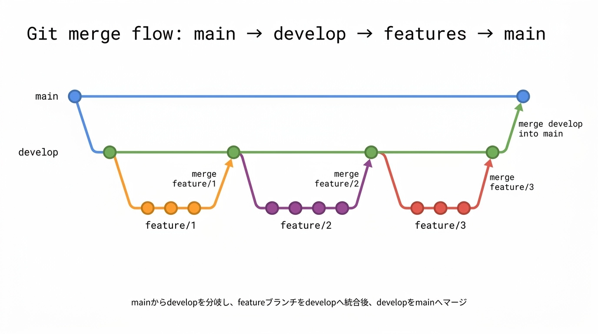

# 開発ガイドライン

## 目次

- [開発ガイドライン](#開発ガイドライン)
  - [目次](#目次)
  - [開発フロー](#開発フロー)
  - [issueのルール](#issueのルール)
  - [開発時のルール](#開発時のルール)
  - [PR（Pull Request）のルール](#prpull-requestのルール)
  - [ブランチ運用ルール](#ブランチ運用ルール)
    - [ブランチ運用フロー](#ブランチ運用フロー)
    - [mainブランチ](#mainブランチ)
    - [developブランチ](#developブランチ)
    - [feature/\*ブランチ](#featureブランチ)
  - [マージ運用](#マージ運用)
  - [コーディング規則](#コーディング規則)
    - [基本方針](#基本方針)
    - [プロジェクト構成](#プロジェクト構成)
    - [フレームワーク・ライブラリ](#フレームワークライブラリ)
    - [コンポーネント](#コンポーネント)
      - [ファイル構成](#ファイル構成)
      - [コンポーネント定義](#コンポーネント定義)
    - [API Routes](#api-routes)
      - [基本構造](#基本構造)
      - [データベース操作](#データベース操作)
      - [エラーハンドリング](#エラーハンドリング)
    - [状態管理](#状態管理)
    - [スタイリング](#スタイリング)
    - [コメント・ドキュメント](#コメントドキュメント)
  - [命名規則](#命名規則)
    - [ファイル・ディレクトリ](#ファイルディレクトリ)
    - [変数・関数](#変数関数)
    - [型定義](#型定義)
    - [API関連](#api関連)
    - [データベース（Prisma）](#データベースprisma)

## 開発フロー

1. issueを作成
2. developブランチからfeatureブランチを切って開発
3. 完了したらPRを発行
4. レビュワーによるレビューをしてマージ

## issueのルール

- 1つの機能・開発に対して、1つのissueを立てる
- issueテンプレートを元に開発内容を記述し、それを見れば開発がスタート出来る状態にする

## 開発時のルール

- 開発するissueを選択し、自身をアサインして開発を行う
- developブランチから`feature/{issue番号}`のブランチを生やし、そこで開発をする

## PR（Pull Request）のルール

- 開発が終了したら、PRを作成する
- PR名は`feature #{issue番号} 開発内容`とする
- PRの内容はテンプレートを元に作業内容・テスト等を記述し、`oden`と誰か1人をレビュワーとして指定する
- PRを公開したら、LINEでレビュワーをメンションしてPRのURLを送る

## ブランチ運用ルール

### ブランチ運用フロー



### mainブランチ

- 本番ブランチ
- ビルド・公開用
- 直接マージ禁止
- developブランチからのマージのみ許可

### developブランチ

- デフォルトブランチ
- 直接マージ禁止
- feature\*ブランチからのマージのみ許可
- developブランチで動作が問題ないことを確認して、mainにマージ

### feature/\*ブランチ

- 作業ブランチ
- developブランチから生やしてここで作業を行う
- 基本的に1つのissueに1つのブランチが対応する
- ブランチ名：`feature/{issue番号}`
  - 例：`feature/1`

## マージ運用

- developブランチにある程度機能が集まったら、mainにマージを行う
- PRを立てて、動作確認等のテストを行い、問題がなければマージをする
- レビュワーに`oden`と誰か1人を指定して行う

## コーディング規則

### 基本方針

- **言語・フレームワーク**: TypeScript + React (Next.js 13)
- **TypeScript設定**: 厳格モード有効（`tsconfig.json`の`strict: true`）
- **Linter**: ESLintは`next/core-web-vitals`に準拠
- **パスエイリアス**: `@/*`を使用して`src/*`を参照

### プロジェクト構成

```
src/
├── app/              # Next.js App Router（ページコンポーネント）
├── pages/api/        # Next.js Pages Router（APIエンドポイント）
├── components/       # 再利用可能なReactコンポーネント
├── Hooks/            # カスタムフック
├── utils/            # ユーティリティ関数
├── constants/        # 定数定義
├── style/            # スタイル定義
└── types/            # TypeScript型定義
```

### フレームワーク・ライブラリ

- **UIフレームワーク**: Chakra UI
- **状態管理**: SWR
- **データベースORM**: Prisma（PostgreSQL）
- **スタイリング**: Chakra UIのprops経由でスタイル適用

### コンポーネント

#### ファイル構成

- メインコンポーネント1つにつき1ファイルを基本とする
- 同一ファイル内に内部用サブコンポーネント（`PCHeader`, `SPHeader`等）を含めることは可
- エクスポート形式：
  - **コンポーネント**: 名前付きエクスポート（`export const Header`）
  - **ページ（`app/`配下）**: デフォルトエクスポート（`export default function Home()`）

#### コンポーネント定義

- クライアントコンポーネントには必ず`"use client"`ディレクティブを記述
- Propsの型定義は`type`で定義し、`コンポーネント名 + Props`とする
- `FC<T>`ジェネリクスで型付け（例: `FC<HeaderProps>`）
- 条件付きレンダリングは三項演算子または`&&`演算子を使用

```typescript
type HeaderProps = {
  isOpen: boolean;
};

export const Header: FC<HeaderProps> = ({ isOpen }) => {
  // ...
};
```

### API Routes

#### 基本構造

- `src/pages/api/`配下にPages Router形式で配置
- HTTPメソッドごとにハンドラー関数を分離（`postHandler`, `deleteHandler`, `putHandler`）
- レスポンス型を明確に定義（`NextApiResponse<Data | Error>`）

#### データベース操作

- Prismaクライアントは`@/pages/api/prisma`からインポート
- 複数クエリは`prisma.$transaction()`でトランザクション化
- エラー時は必ず`prisma.$disconnect()`を実行

#### エラーハンドリング

- ステータスコード付きでJSONレスポンスを返す
- `utils/logger.ts`を使用してログを記録
- エラーメッセージはユーザーフレンドリーな日本語で返す

```typescript
if (error) {
  res.status(400).json({ message: "予約制限に達しています" });
  return;
}
```

### 状態管理

- **ローカル状態**: `useState`を使用
- **サーバー状態**: SWRを使用（fetcher関数は`Provider.tsx`で定義）
- **メモ化**: コールバック関数は`useCallback`、計算値は`useMemo`でメモ化

### スタイリング

- Chakra UIのprops経由でスタイルを適用
- レスポンシブ対応はChakra UIのオブジェクト記法を使用
- 共通スタイルは`src/style/style.ts`で定義してエクスポート

```typescript
// style.ts
export const headingStyle = {
  base: "18px",
  lg: "24px",
  xl: "32px",
};

// 使用例
<Heading fontSize={headingStyle}>タイトル</Heading>
```

### コメント・ドキュメント

- **JSDoc**: API関数のパラメータと戻り値を記述
- **TODO**: 将来の実装予定を記述
- **NOTE**: 重要な注意事項や仕様を記述
- 複雑なロジックには日本語で説明コメントを追加

## 命名規則

### ファイル・ディレクトリ

| 種類                     | 命名規則                 | 例                                   |
| ------------------------ | ------------------------ | ------------------------------------ |
| コンポーネントファイル   | PascalCase               | `Header.tsx`, `ReservationForm.tsx`  |
| ユーティリティ・ヘルパー | camelCase                | `validation.ts`, `logger.ts`         |
| カスタムフック           | camelCase（useで始まる） | `useTime.tsx`, `useIsPc.tsx`         |
| ディレクトリ             | snake_case               | `reservation_form/`, `display_time/` |
| APIルート                | kebab-case               | `edit-confirm.ts`, `today.ts`        |

### 変数・関数

| 種類                       | 命名規則               | 例                                      |
| -------------------------- | ---------------------- | --------------------------------------- |
| コンポーネント             | PascalCase             | `Header`, `ReservationForm`, `PCHeader` |
| 関数                       | camelCase              | `handleClick`, `validateStudentId`      |
| 変数（通常）               | camelCase              | `studentsIds`, `tabIndex`, `pathname`   |
| 定数（エクスポート）       | PascalCase             | `DisplayPeriod`, `PCImagePath`          |
| 定数（ローカル・リテラル） | camelCase              | `urls`, `tabStyle`, `fetcher`           |
| boolean変数                | is/has等で始まる       | `isOpen`, `isPc`, `isLoading`           |
| イベントハンドラ           | handleまたはonで始まる | `handleClick`, `onClose`                |
| カスタムフック             | useで始まる            | `useTime`, `useIsPc`                    |

### 型定義

| 種類    | 命名規則                 | 例                             |
| ------- | ------------------------ | ------------------------------ |
| 型名    | PascalCase               | `HeaderProps`, `Data`, `Error` |
| Props型 | コンポーネント名 + Props | `ReservationFormProps`         |
| 型定義  | typeを使用               | `type HeaderProps = { ... }`   |

### API関連

| 種類                   | 命名規則             | 例                                           |
| ---------------------- | -------------------- | -------------------------------------------- |
| APIハンドラー関数      | メソッド名 + Handler | `postHandler`, `deleteHandler`, `putHandler` |
| リクエストボディのキー | camelCase            | `studentsIds`, `reservationId`               |

### データベース（Prisma）

- モデル名はPascalCase（`Reservation`, `Student`）
- フィールド名はcamelCase（`studentId`, `reservationId`）
- リレーションテーブル名は両モデル名を組み合わせる（`ReservationStudent`）
